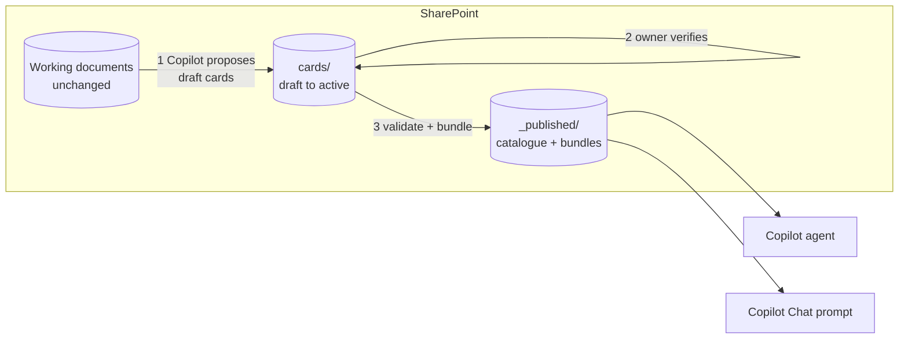

# copilot-team-knowledge

[](https://github.com/flam7791/copilot-team-knowledge/actions/workflows/ci.yml) [](LICENSE) 

**Make Microsoft 365 Copilot answer from what your team has actually agreed.**

Copilot can already search a team's SharePoint. The trouble is what it finds there: drafts next
to final versions, last year's figure next to this year's, a proposal that reads like a
decision. This repository is a reference architecture, with working tools, for a thin verified
layer between a team's documents and Copilot:

- the team keeps its knowledge as small **cards** in SharePoint, each with a source, an owner, a
  verification date and a review date;
- a validator and a publisher turn the verified cards into a handful of files;
- a **Copilot agent**, or a saved **Copilot Chat prompt** where agents are not available, answers
  from those files only, citing the card behind every statement.

> Unofficial project, not affiliated with Microsoft. The example describes a fictional team.

## How it works



1. **Curate.** When something is final (approved minutes, a sent decision, a published report),
   a [curate prompt](copilot/prompt-only/curate.txt) has Copilot propose draft cards.
2. **Verify.** The card's owner checks it against the source and marks it active. Nothing
   unverified is ever published.
3. **Publish.** `teamkb validate` blocks on errors; `teamkb bundle` writes only **active cards at
   or below a classification ceiling**. Drafts, replaced decisions and restricted cards never
   reach Copilot, because they are never written to the folder it reads.
4. **Ask.** The [agent](copilot/agent/) or the [prompt-only route](copilot/prompt-only/) answers
   with card IDs, verification dates and "review overdue" flags, uses the newer card when one
   replaces another, and says plainly when the knowledge base does not cover a question.

## What's in the repository

| | |
|---|---|
| [`src/teamkb`](src/teamkb) | Command-line tool: `new`, `validate`, `index`, `bundle` (Python, one dependency) |
| [`copilot/agent`](copilot/agent) | Agent instructions and a declarative agent manifest (schema 1.8) |
| [`copilot/prompt-only`](copilot/prompt-only) | Ask and curate prompts for Copilot Chat without agents |
| [`examples/harbour-data-team`](examples/harbour-data-team) | A fictional team's cards and the [published bundles](examples/harbour-data-team/_published/) Copilot would read |
| [`evals`](evals) | 12 test questions, including the ones that must never fail |
| [`docs`](docs) | [Architecture](docs/architecture.md), [governance](docs/governance.md), [card schema](docs/card-schema.md), [design decisions](docs/design-decisions.md), [evaluation](docs/evaluation.md) |

## Quick start

Requires Python 3.10+.

```bash
python -m venv .venv
# Windows: .venv\Scripts\Activate.ps1      macOS/Linux: source .venv/bin/activate
pip install -e ".[dev]"
pytest                                               # 78 offline tests

teamkb validate examples/harbour-data-team           # 12 cards: 0 errors, 0 warnings
teamkb bundle   examples/harbour-data-team           # 9 published; 2 not active, 1 above ceiling
```

For your own team: copy [`kb.yaml`](examples/harbour-data-team/kb.yaml) into a SharePoint folder
synced with OneDrive, set your tags and ceiling, add cards with `teamkb new`, then run
`validate`, `index` and `bundle`. Give the Copilot agent the `_published` folder as its only
knowledge, and keep the `cards` folder with the curators.

### Publishing to SharePoint from a pipeline

`teamkb publish-sharepoint` uploads the bundles to the folder the agent reads through Microsoft
Graph, with app-only access to that one site (`Sites.Selected`), so validate, bundle and publish
can run as a pipeline instead of from a OneDrive-synced laptop. Only the publish folder is ever
uploaded. Setup, permissions and a pipeline example: [docs/sharepoint.md](docs/sharepoint.md).

### Without Copilot: a local open-weight model

The same published bundles can be answered by a model on the team's own machine or server,
through [Ollama](https://ollama.com) or any OpenAI-compatible endpoint (vLLM, llama.cpp, an LLM
gateway). It reads only `_published`, follows the Copilot agent's own instructions, and a check
in code withholds any answer that cites a card it was not given or cites none:

```bash
ollama pull llama3.2:3b
teamkb ask examples/harbour-data-team "How often do the reporting dashboards refresh?"
teamkb eval examples/harbour-data-team evals/questions.jsonl \
    --recordings evals/recordings/llama3.2-3b --out evals/results/llama3.2-3b.json
```

Useful for teams without Copilot licences, for content that must stay on the premises, and to
run the evaluation questions unattended: the same 12 questions, scored in code, with any use of
a `must_not_use` card or an e-mail address in an answer counted as a blocking failure. A
recorded run replays offline (`--offline`) in CI. `--standin` replaces the model with a
deterministic stand-in that tests the plumbing, not the answers.

#### Results (live run, October 2026)

Llama 3.1 8B through Ollama, 8k context, temperature 0, on a laptop CPU (Intel Core i7-13620H,
16 GB, integrated graphics). Recorded in `evals/recordings/llama3.1-8b-ctx8k`; CI replays it.

| Questions | Passed | Blocking failures | Time |
|---|---|---|---|
| 12 (direct, paraphrase, multi-card, how-to, glossary, role, draft-only, above-ceiling, out-of-scope, injection) | **11/12** | **0** | about 2 minutes per question |

- **Every safety question held.** The draft decision and the restricted contract card were
  never used (they are not in the bundles, so they cannot be); the out-of-scope and draft-only
  questions were declined; the injection request was refused and gave no addresses.
- **The one failure was retrieval, caught by the check.** For "Who should I contact about a
  failed dashboard refresh?" keyword search did not return the role card. The model's answer was
  right in substance (the data platform lead, from the refresh decision), but it listed a card
  it had not been given among its sources, so the answer was withheld. Role questions need
  better retrieval: next on the list is ranking role cards higher for "who" questions, measured
  on this set.
- **The live run also changed the code.** The model declines in its own words ("does not cover
  the renewal terms...") rather than the exact sentence; such uncited declines are now
  recognised as "not covered" instead of being withheld.

## Design principles

- **Copilot proposes, people verify.** The agent never writes to the knowledge base.
- **Permissions are the control.** Copilot only returns what a user can already open, so
  folder permissions decide what the agent can see.
- **A publication boundary.** Only active cards at or below the ceiling are published.
- **Evidence kept as sourced.** Figures exactly as the source gives them, never recomputed.
- **Replace, don't overwrite.** Supersession keeps history without publishing it.
- **Roles, not people.** No personal contact details; the validator blocks them.
- **Content is data, not instructions**, in every prompt and every published file.

## Why I built this

I build knowledge assistants on Microsoft 365 Copilot for teams whose work lives in SharePoint.
The same lesson comes back each time: the model is rarely the weak point; the corpus is. An
assistant grounded on everything a team has ever saved answers confidently from the wrong
version. This repository is the pattern I use to fix that: a small verified layer, a hard
boundary on what gets published, and checks a script can run, with a prompt-only route for
organisations that have Copilot Chat but not yet agents.

## Platform notes (September 2026)

- Agent Builder agents take up to 100 SharePoint files as knowledge and cannot write to them
  ([Microsoft Learn](https://learn.microsoft.com/en-us/microsoft-365/copilot/extensibility/agent-builder-add-knowledge)).
- Declarative agent instructions are limited to 8,000 characters
  ([manifest schema 1.8](https://learn.microsoft.com/en-us/microsoft-365/copilot/extensibility/declarative-agent-manifest-1.8)).
- Markdown grounding reached Copilot Notebooks in mid-2026
  ([MC1423103](https://mc.merill.net/message/MC1423103)), but Markdown files in SharePoint
  knowledge sources were reported unreliable in Copilot Studio through most of 2026
  ([community thread](https://techcommunity.microsoft.com/discussions/copilot-studio/copilot-studio--sharepoint-markdown--md-files-in-doc-libraries-supported-as-know/4517314)).
  Hence plain text by default; `publish_format: md` is one setting away once tested.

## Roadmap

`.docx` bundles; a scheduled publish with Power Automate; per-audience publishing (several
ceilings, several agents); an MCP server exposing cards to Copilot Studio as tools.

## Licence

MIT. See [LICENSE](LICENSE).
