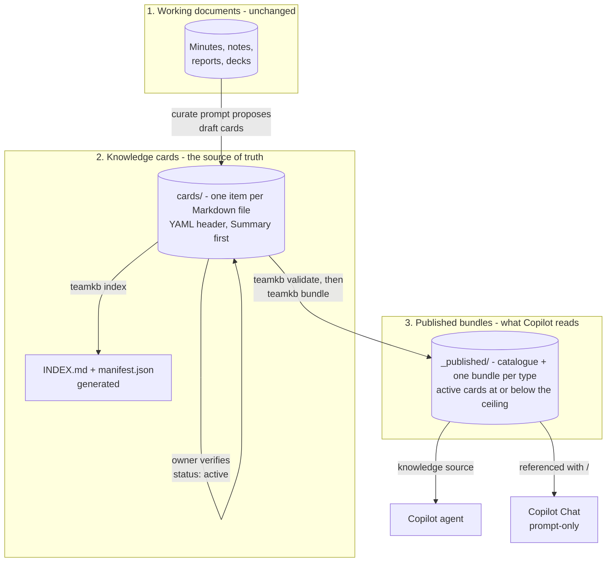

# Architecture

## The problem

A team's knowledge is spread across meeting minutes, decision e-mails, slide decks and people's
heads. Microsoft 365 Copilot can search all of it, but it answers from whatever it finds: a
draft as readily as a final version, last year's figure as readily as this year's, a proposal
as readily as a decision. Answers are only as good as the corpus.

This architecture adds a thin, **curated layer** between the team's working documents and
Copilot. The working documents stay where they are. The curated layer holds only what the team
has verified, one item per card, with its source, owner and review date. Copilot answers from
that layer.

## Three layers

| Layer | Holds | Written by | Read by |
|---|---|---|---|
| Working documents | Everything the team produces | The team, as today | People; the curate prompt |
| Knowledge cards | One durable item per file, verified | Curator (drafts), owner (verification) | People, `teamkb`, reviewers |
| Published bundles | Active cards at or below the ceiling | `teamkb bundle` only | Copilot |

## The card

One Markdown file per item, of seven types: decision, fact, meeting outcome, project, how-to,
term, role. A YAML header carries the metadata; the body opens with a `## Summary` that makes
sense on its own, because Copilot retrieves passages, not whole folders. Full field reference:
[card-schema.md](card-schema.md).

## The workflow

1. **Capture.** Nothing new: the team keeps working in its documents.
2. **Curate.** When something becomes final (approved minutes, a sent decision, a published
   report), the curator runs the curate prompt. Copilot proposes draft cards; the curator
   creates them with `teamkb new` and checks every statement against the source.
3. **Verify.** The card's owner checks it, sets `status: active`, and fills `verified` and
   `review_by`. Nothing is published until this happens.
4. **Publish.** `teamkb validate` (errors block), `teamkb index`, `teamkb bundle`. In a Git
   setup, continuous integration runs the same checks on every change.
5. **Ask.** Team members ask the agent, or use the saved prompt in Copilot Chat.
6. **Review.** `teamkb validate` warns when a card's `review_by` date has passed. The owner
   confirms it, updates it, or replaces it with a new card (`supersedes` / `superseded_by`).

## Two deployment modes

| | A. SharePoint-first | B. Git-first |
|---|---|---|
| Cards live in | The SharePoint library, synced with OneDrive | A Git repository |
| `teamkb` runs | On a curator's machine, against the synced folder | Locally and in CI |
| Publishing | `teamkb bundle` writes straight into the synced `_published` folder | CI or the curator copies `_published` to SharePoint |
| History and review | SharePoint version history | Pull requests, diffs, CI checks |
| Suits | Teams that do not use Git | Technical teams |

In both modes the Copilot agent is given the `_published` folder **only**. In mode A the cards
folder is also in SharePoint, so a prompt-only user whose Copilot Chat searches all their work
content can still reach drafts. Keep the cards folder's permissions to the curators, or use
mode B.

## Why bundles, not the cards themselves

- **File limits.** An Agent Builder agent takes up to 100 SharePoint files as knowledge
  (Microsoft documentation, updated 25 September 2026). Bundles keep a knowledge base of any
  size to about ten files.
- **Prompt-only use.** A user can reference two or three files with "/", not a hundred.
- **Format.** Plain text is read consistently across Copilot surfaces. Markdown support has
  arrived in some surfaces (Copilot Notebooks, mid-2026) but was reported unreliable for
  SharePoint knowledge in Copilot Studio through most of 2026. `publish_format: md` is
  available; test it in your tenant before switching.
- **A clean boundary.** Only active cards at or below the publish ceiling are written.
  Drafts, replaced cards and restricted cards cannot leak through a bundle because they are
  never in one.
- **A read check.** Each bundle carries a version line with a content hash. Prompts ask Copilot
  to echo it, which shows immediately whether a referenced file was actually read.

## What is deliberately not here

- **No agent that writes.** Copilot proposes cards; people create, verify and publish them.
- **No index-walking.** Copilot finds content by search, not by opening an index file and
  following links. The index is for people and reviewers; Copilot gets a catalogue inside the
  published set.
- **No copies of raw e-mail or chat.** Cards summarise final sources and link to them. The
  sources keep their own permissions and retention.
- **No personal profiles.** Role cards describe responsibilities, not people.
